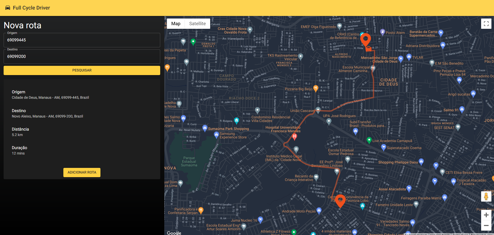

<h1 align="center">Vehicle Tracking</h1>

<h4 align="center"> 
  🚧 Vehicle Tracking 📍 Concluído 🚀 🚧
</h4>

<p align="center">
  <a href="#-overview">Overview</a> •
  <a href="#-run-project">Run Project</a> • 
  <a href="#-executar-testes">Executar testes</a> • 
  <a href="#-tecnologias">Tecnologias</a> • 
  <a href="#-autor">Autor</a> • 
  <a href="#-licença">Licença</a>
</p>

<br>

<h1 align="center">
  
</h1>


## 📝 Overview

System for monitoring vehicles in real time through location. The system consists of a Front-end application where it is possible to register the routes, the drivers can start the routes and an admin can follow the path of the drivers in motion. In addition, it has a Back-end that receives requests from the Front-end, makes calls directly to the google maps api, does data processing, sends some data to a processing queue which in turn sends it to Kafka, in addition to receiving and sending requests in real time via WebSockets. Also, it has a service that consumes Kafka messages and automatically calculates shipping value. Finally, you can monitor shipping service metrics with Prometheus and Grafana.

<br>

## 🚀 Run Project

1️⃣ Clone project and access its folder:

```bash
$ git clone https://github.com/jtiagosantos/vehicle-tracking-app.git
$ cd vehicle-tracking-app
```

2️⃣ Start kafka service:

```bash
//inside the folder kafka
$ docker compose up
```

3️⃣ Configure prometheus:

Create a .docker folder inside the shipping-calculation-folder, create a prometheus folder inside
the .docker folder and then add the following content in a prometheus.yaml file inside the 
prometheus folder

```yaml
global:
  scrape_interval: 15s

scrape_configs:
  - job_name: 'prometheus'
    static_configs:
      - targets: ['prometheus:9090']

  - job_name: 'goapp'
    static_configs:
      - targets: ['host.docker.internal:8080']
```

4️⃣ Start prometheus and grafana:

```bash
//inside the shipping-calculation-service folder
$ docker compose up
```

5️⃣ Build shipping service:

```bash
//inside the shipping-calculation-service folder
$ docker build -t shipping-calculation .
```

6️⃣ Start shipping service:

```bash
//inside the shipping-calculation-service folder
$ docker run -p 8080:8080 shipping-calculation
```


7️⃣ Install dependencies (main-api):

```bash
//inside the folder main-api
$ npm i
```

8️⃣ Start the database:

```bash
//inside the folder main-api
$ docker-compose up -d
```

9️⃣ Generate prisma types:

```bash
//inside the folder main-api
$ npx prisma generate
```

1️⃣0️⃣ Set the environment variables (main-api):

Create a .env file inside the main-api folder with the following structure

```bash
DATABASE_URL=""
GOOGLE_MAPS_API_KEY=""
```

1️⃣1️⃣ Start back-end:

```bash
//inside the folder main-api
$ yarn start:dev
```

<br>

1️⃣2️⃣ Install dependencies (front-end):

```bash
//inside the folder front-end
$ npm i
```

1️⃣3️⃣ Set the environment variables (front-end):

Create a .env file inside the front-end folder with the following structure

```bash
NEXT_PUBLIC_GOOGLE_MAPS_API_KEY=""
```

1️⃣4️⃣ Start the front-end:

```bash
//inside the folder front-end
$ npm run dev
```


<br>

## 🛠 Tecnologias

The following tools were used in the construction of project:

- **[Docker](https://www.docker.com/)**
- **[Docker Compose](https://docs.docker.com/compose/)**
- **[Kafka](https://kafka.apache.org/)**
- **[Prometheus](https://prometheus.io/)**
- **[Grafana](https://grafana.com/)**
- **[Node.js](https://nodejs.org/en)**
- **[Typescript](https://www.typescriptlang.org/)** 
- **[NestJs](https://nestjs.com/)**
- **[Prisma.io](https://www.prisma.io/docs)**
- **[MySQL](https://www.mysql.com/)**
- **[MongoDB](https://www.mongodb.com/)**
- **[Redis](https://redis.com/)**
- **[Bull](https://github.com/OptimalBits/bull)**
- **[Socket IO](https://socket.io/)**
- **[Google Maps API](https://developers.google.com/maps?hl=pt-br)**
- **[Material UI](https://mui.com/)**

<br>

## 👨‍💻 Author


<strong><a href="https://github.com/jtiagosantos">Tiago Santos </a>🚀</strong>

[](https://www.linkedin.com/in/josetiagosantosdelima/)
[](mailto:tiago.santos@icomp.ufam.edu.br)

<br>

## 📝 License

This project is under license [MIT](./LICENSE).